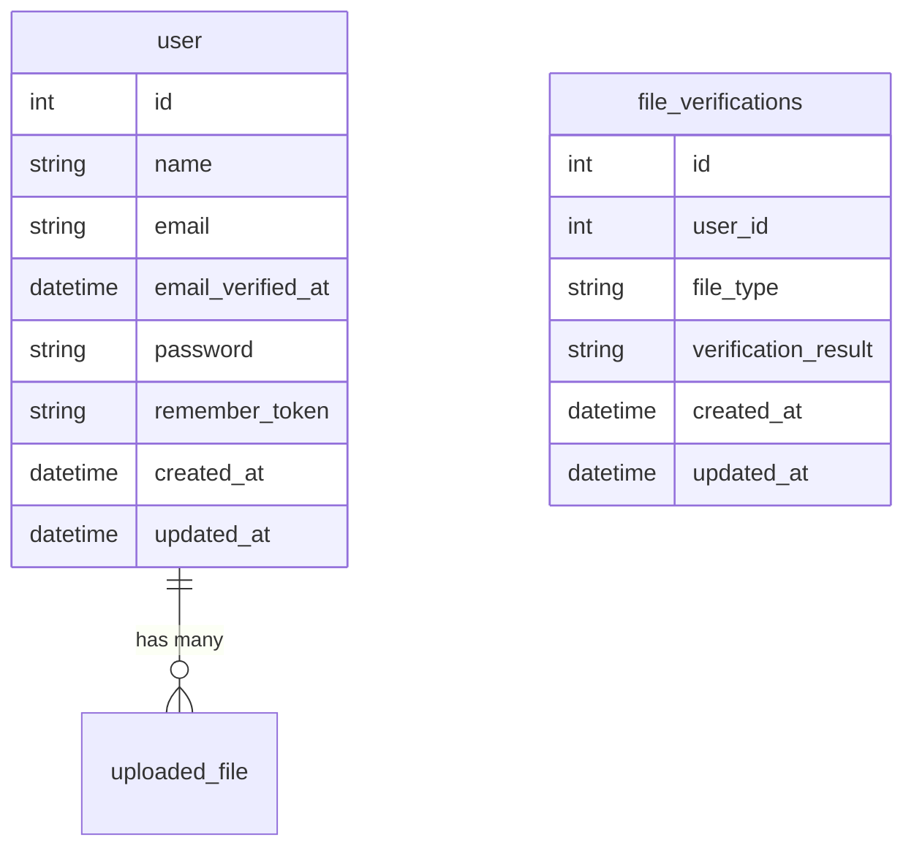
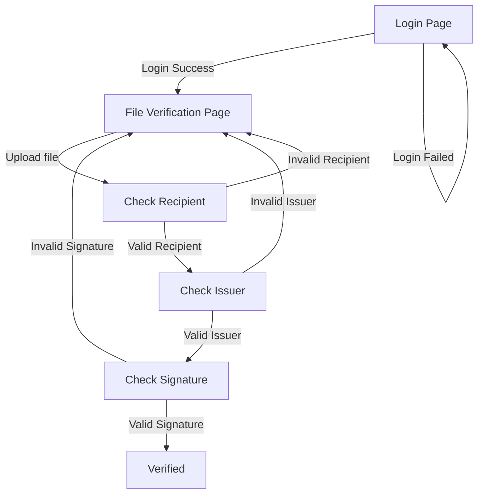

# Accredify Assessment

1. [Installation](#Installation)
2. [Entity Relation Diagram](#ERD)
3. [FlowChart](#Flowchart)
4. [Testing](#Testing)


## Installation
1. **Clone the repository:**
    ```sh
    git clone https://github.com/pohchai21/accredify.git
    cd accredify
    ```

2. **Install dependencies:**
    ```sh
    composer install
    ```

3. **Setup environment variables:**
    Copy the `.env.example` to `.env` and configure your database and other environment variables.
    ```sh
    cp .env.example .env
    php artisan key:generate
    ```

4. **Run migrations:**
    ```sh
    php artisan migrate
    php artisan db:seed --class=AddDefaultUserSeeder
    ```
    The seeding will provide user record with the credentials like below
    Email    = testuser1@test.com
    Password = testuser1

5. **Serve the application:**
    ```sh
    php artisan serve
    ```

## ERD


## Flowchart


### Running Tests

1. **Run tests:**
    ```sh
    php artisan test --filter=FileUploadTest
    ```
